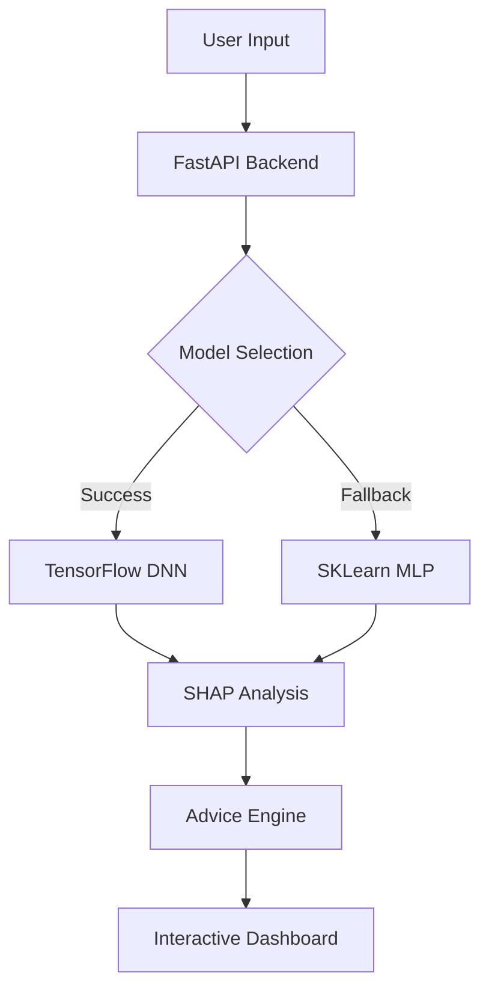

# 🎓 Student Success Predictor (XAI Dashboard)

<p align="center">
  
</p>

[](https://fastapi.tiangolo.com/)
[](https://www.tensorflow.org/)
[](https://scikit-learn.org/)
[](https://shap.readthedocs.io/)

A state-of-the-art **Student Performance Prediction System** combined with **Explainable AI (XAI)**. This dashboard empowers educators and parents by not only predicting a student's final grade (G3) but also explaining *why* the model reached that conclusion using **SHAP (SHapley Additive exPlanations)**.

---

## 🌟 Key Features

- **🎯 Deep Learning Engine**: Uses a multi-layer Neural Network (TensorFlow) to predict student outcomes based on 32 complex behavioral and academic factors.
- **🔍 Explainable AI (SHAP)**: Integrated **SHAP KernelExplainer** provides interactive force plots that decompose predictions, showing exactly which factors (e.g., absences, study time) pushed the grade up or down.
- **💡 Intelligent Advice System**: A built-in reasoning engine that translates negative SHAP values into actionable, human-readable feedback for student improvement.
- **🛡️ Adaptive Fallback**: Automatically detects system capabilities and switches to a Scikit-Learn `MLPRegressor` if TensorFlow is unavailable.
- **🎨 Glassmorphism Dashboard**: A modern, responsive UI built with vanilla CSS, featuring real-time interactive plots and premium "frosted glass" aesthetics.

---

## 🏗️ System Architecture



---

## 🛠️ Tech Stack

- **Backend**: FastAPI (Python)
- **Machine Learning**: TensorFlow / Scikit-Learn
- **Explainability**: SHAP (SHapley Additive exPlanations)
- **Data Handling**: Pandas, NumPy
- **Frontend**: HTML5, Vanilla CSS (Glassmorphism), JavaScript (Fetch API)

---

## 🚀 Getting Started

### Prerequisites

- Python 3.9 or higher
- Git

### Installation

1. **Clone the repository**:
   ```bash
   git clone https://github.com/dheeraj0677/Student-Perormance-Predictor.git
   cd Student-Perormance-Predictor
   ```

2. **Set up a virtual environment**:
   ```bash
   python -m venv venv
   source venv/bin/activate  # On Windows: venv\Scripts\activate
   ```

3. **Install dependencies**:
   ```bash
   pip install -r requirements.txt
   ```

### Running the Application

1. **Start the server**:
   ```bash
   python app.py
   ```
   *The system will automatically train the model on the `student-mat.csv` dataset upon the first startup.*

2. **Access the Dashboard**:
   Navigate to `http://127.0.0.1:8000` in your browser.

---

## 📊 Dataset Overview

The project utilizes the **Student Performance Data Set** from the UCI Machine Learning Repository. It tracks student achievement in secondary education across two Portuguese schools, covering:
- **Demographics**: Address, family size, parents' status.
- **Academic**: Past failures, school support, study time.
- **Social**: Alcohol consumption (Dalc/Walc), social outings, family relationships.
- **Target**: G3 (Final Grade, 0-20 scale).

---

## 📜 License

This project is licensed under the MIT License - see the [LICENSE](LICENSE) file for details.

---

**Developed with ❤️ by [Your Name] for Academic Excellence.**

